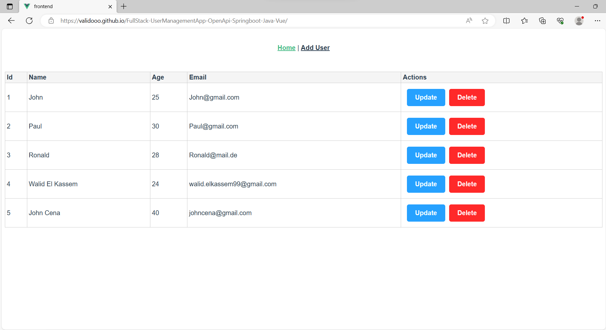
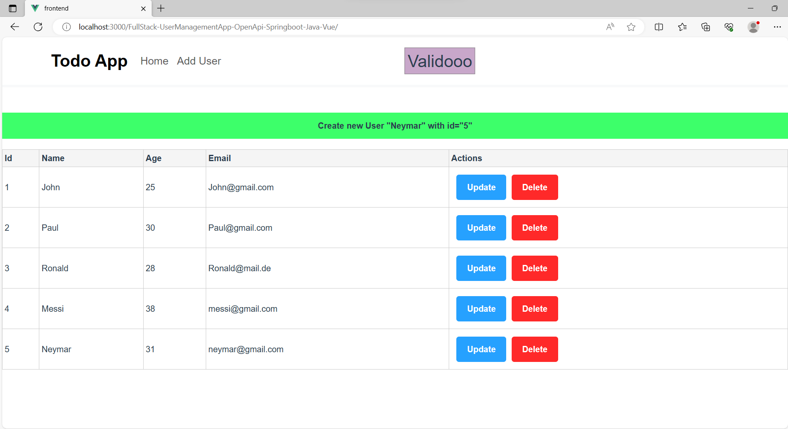
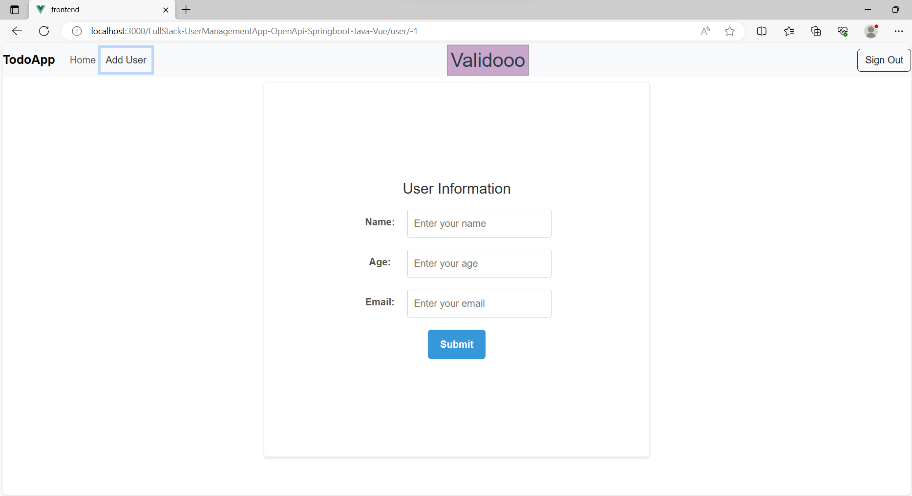
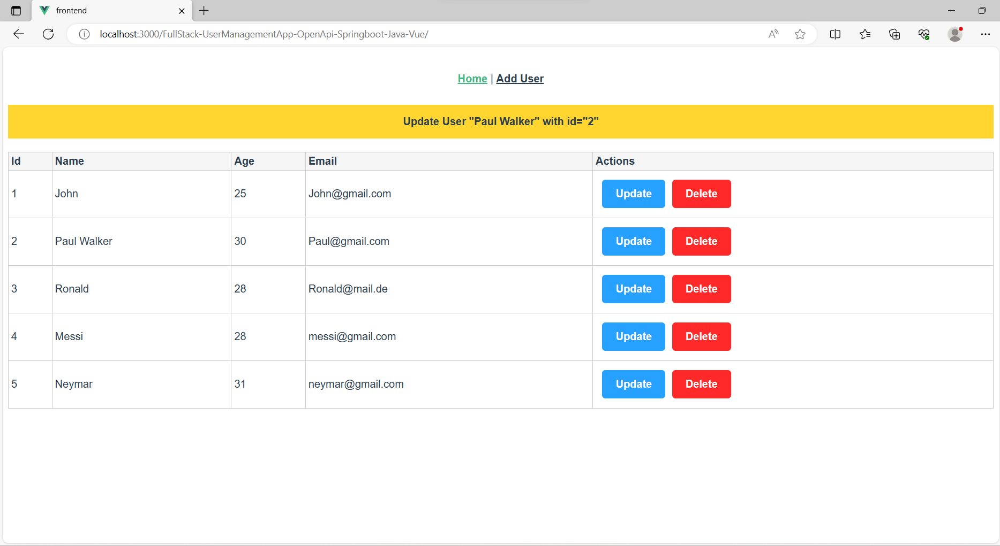
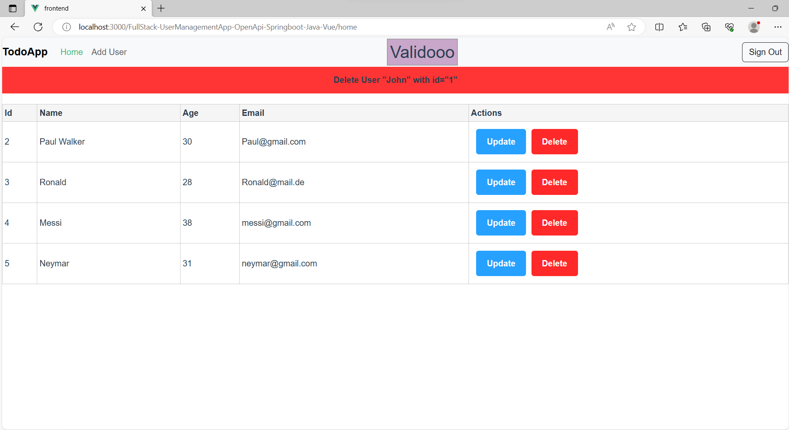

<h1><a href= "https://validooo.github.io/FullStack-UserManagementApp-OpenApi-Springboot-Java-Vue/"> Link to website</a></h1>

The project allows users to create contacts and manage them. It uses the OpenAPI generator to generate REST API classes in Java from a YAML file where the REST API endpoints are defined. The generated classes are then implemented with self-written classes (Controller, Service, Entity, Repository). The frontend is built with Vue and is a single-page application that comprises two routes (Userlist and AddEditUser).

<h2> Steps to follow: </h2>

* Install Npm, Vue Cli, Java
* To run the Vue app, use the command  `npm run serve`.
* Import the Spring Boot backend project into Eclipse or IntelliJ as a Maven project.
* Compile the project using Maven to generate the REST API classes.
* Launch the Application

<h2> Notes: </h2>

* The database is configured in the application.properties file.
* The online version uses the store created by Vue's reactive to store the data.
* The YAML file is located in the resources folder.

<h2>Screenshots</h2>

<b>1- User list</b>

<b>2- Add new User</b>

<b>3-Update User Details</b>

<b>4-User Updated</b>

<b>5-User Deleted</b>

