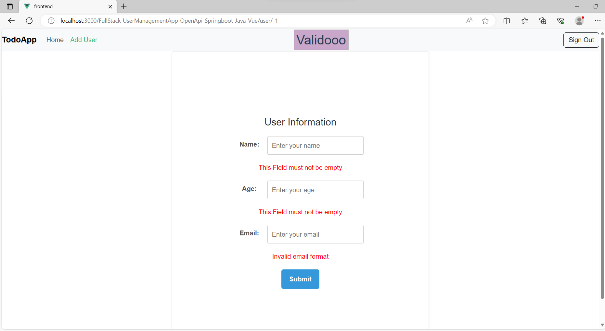
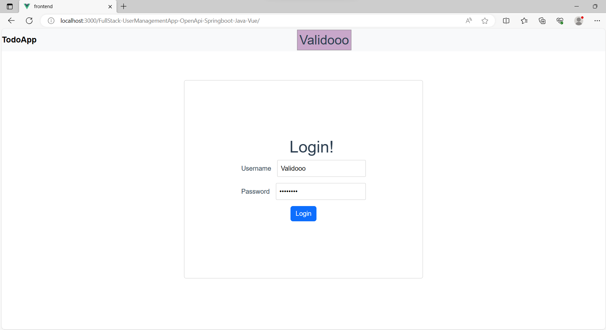

<h1><a href= "https://validooo.github.io/FullStack-UserManagementApp-OpenApi-Springboot-Java-Vue/"> Link to website</a></h1>

The project allows users to create contacts and manage them. It utilizes the OpenAPI Generator plugin to generate REST API classes in Java from a YAML file where the REST API endpoints are defined. The generated classes are subsequently implemented with self-written components (Controller, Service, Entity, Repository). We have employed Spring Boot to manage our dependencies, import the OpenAPI Generator plugin, and facilitate database generation. The frontend is constructed using Vue and is presented as a single-page application encompassing two routes (Userlist and AddEditUser).

<h2> Steps to follow: </h2>

* Install Npm, Vue Cli, Java
* To run the Vue app, use the command  `npm run serve`.
* Import the Spring Boot backend project into Eclipse or IntelliJ as a Maven project.
* Compile the project using Maven to generate the REST API classes.
* Launch the Application

<h2> Features:</h2>
* The Vue app online version uses Vuex store to store the data.
* Input Validation
* Login Authentication and Route Protection (Please use the username 'Validoo' and the password 'password' to sign in).
* Displaying Actions Notifications on the Home Page.

<h2> Notes: </h2>
* The OpenAPI Generator plugin is defined in the pom.xml file.
* The database is configured in the application.properties file.
* The YAML file is located in the resources folder.

  <h2>Deploying to GitHub Pages:</h2>  
* The GitHub Pages link is automatically built after each push to GitHub using GitHub Actions.

  
  
  <h2>Reference: </h2>
* This project used the following tutorial as a reference: https://medium.com/swlh/vue3-using-ref-or-reactive-88d47c8f6944.

<h2>Screenshots</h2>

<b>1- User list</b>

<b>2- Add new User</b>

<b>3-Update User Details</b>

<b>4-User Updated</b>

<b>5-User Deleted</b>

<b>6-Validate Input</b>

<b>7-Login Page</b>

